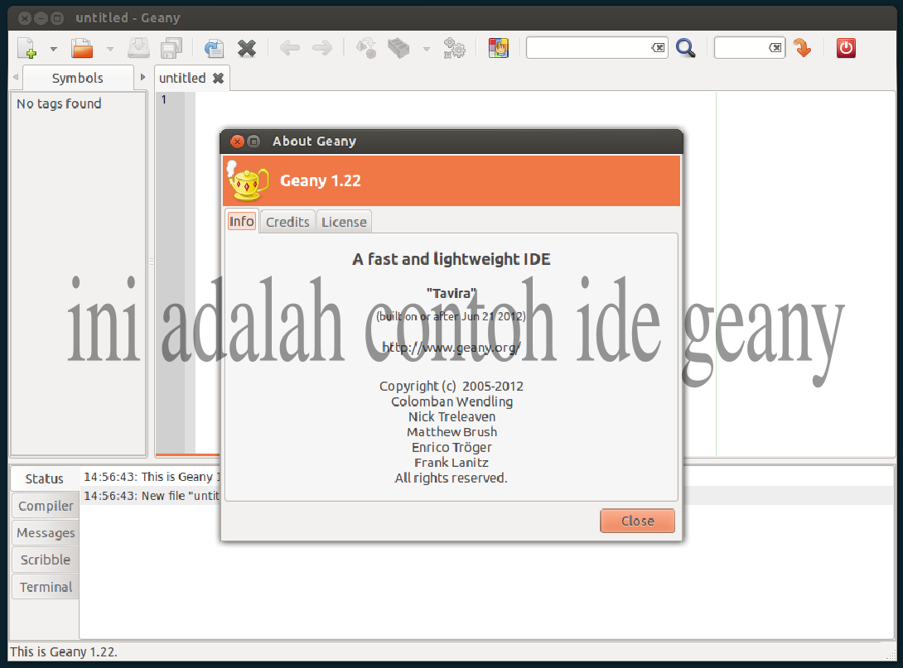
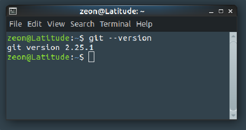

### PRAKRIKUM MINGGU 1 (judul dari pekan praktikum)

pada minggu 1 telah  dipelajari cara menginstall IDE geany dan git, dimana hasil nya di upload di github pribadi (kata-katanya bisa ditambahkan)

## Instal geany
Berikut adalah hasil install IDE geany

(Ditampilkan gambarnya)

## Install git
Ini adalah version dari git yang telah terinstaall

(di tampilkan gambar git-nya)
